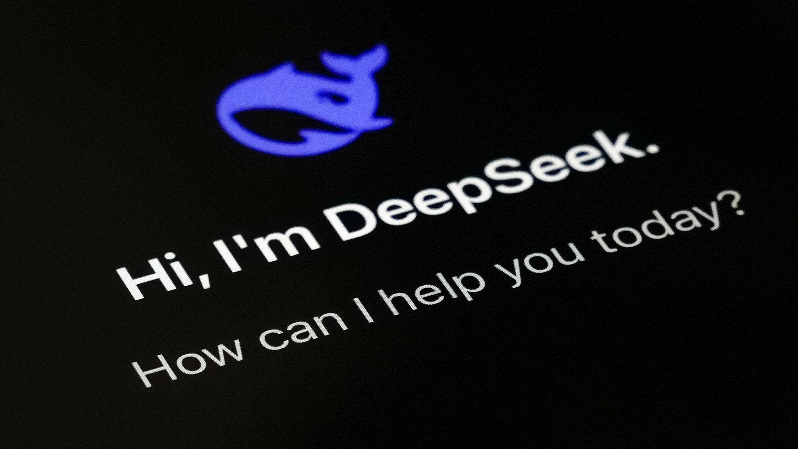

# 🚀 DeepSeek R1 Running Locally – Full Setup Guide  

## 🔥 What is DeepSeek R1?  

- **DeepSeek R1** is a powerful **open-source AI model** that rivals **OpenAI o1** and **Claude 3.5 Sonnet** in **math, coding, and reasoning tasks**.  
- The best part? You can run it **locally on your own machine** for **free**, ensuring **total privacy** without relying on cloud services.

## 🛠️ Setup Guide (Windows, Mac, Linux)  
Follow these simple steps to get DeepSeek R1 running on your system:  

### 1️. Install Ollama  

 - Ollama is a framework for running large language models (LLMs) locally on your machine. It lets you download, run, and interact with AI models without needing cloud-based APIs. 
 - #### Download it here:  🔗 [Ollama Download](https://ollama.com/download)  

### 2️. Download Models 
#### DeepSeek R1 comes in different sizes, each tailored for various levels of processing power and use cases. Below are the model options you can choose from:

<details>
 <summary> <b> 1.5B (smallest)</b> : lightest, ideal for testing or low-resource machines. </summary>

```
ollama run deepseek-r1:1.5b
```
</details>

<details>
 <summary> <b> 8B </b> : (Faster) Balanced performance, a solid starting point </summary>
  
 ```
 ollama run deepseek-r1:8b
 ```  
</details>

<details>
 <summary> <b>  14B </b> : Improved performance for demanding tasks (High-Level GPU) </summary>
   
``` 
ollama run deepseek-r1:14b
```
</details>

<details>
<summary> <b>  32B  </b>  : Larger and more powerful, need Enterprise-level GPU power. </summary>
  
```
ollama run deepseek-r1:32b
```
</details>

<details>
 <summary> <b> 70B (largest/smartest) </b> :  (IMPOSSIBLE) Larger and more powerful, needs more GPU power. </summary>
   
```
ollama run deepseek-r1:70b
```
</details>

- Select Your Model based on your device.
- Open Command Prompt and 

### 3️. Set Up fo  
[Chatbox](https://chatboxai.app) is a **free, privacy-focused desktop client** for AI models.  

#### Steps to Configure Chatbox with Ollama:  
1. Download & install [Chatbox](https://chatboxai.app)  
2. Open **Settings** and change the **model provider** to **Ollama**  
3. Set the Ollama API host to `http://127.0.0.1:11434`  
4. **Save settings & start chatting with DeepSeek R1!** 🚀  


---  

## 🧪 Performance Tests  
Here are some **real-world tests** I ran on my local DeepSeek R1 setup:  

### 🔹 Explain TCP  
DeepSeek R1 provided a solid technical explanation of TCP concepts.  

### 🔹 Generate a Pac-Man Game  
It successfully generated Pac-Man game code! Though, some small bugs required manual fixes.  

---  

## 🤔 Final Thoughts  
I was initially **skeptical** due to the hype around AI models, but **DeepSeek R1 performs surprisingly well** for a **free, open-source model** that runs locally. It may not fully replace OpenAI or Claude, but it's a **great self-hosted alternative** for coding, reasoning, and general AI tasks.  

What do you think? **Try it out and let me know your thoughts!** 👇  
